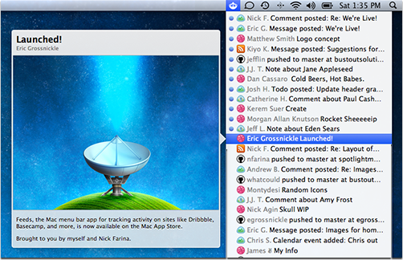

Overview
========

Feeds lives in your Mac's menu bar and lets you quickly view the content of new posts on your favorite web services without ever opening a browser window.

For more information, see the [Official Website](http://www.feedsapp.com).

Adding Accounts
===============

To add a new service to Feeds, you simply write an `Account` subclass. We're still working on documentation for how to write these classes, but you can examing the existing ones to get a sense for it.